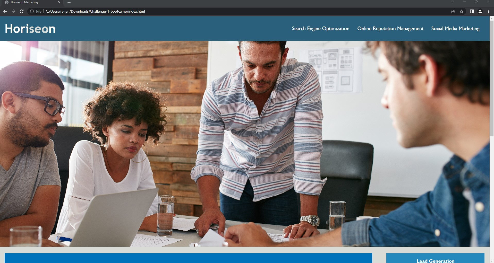
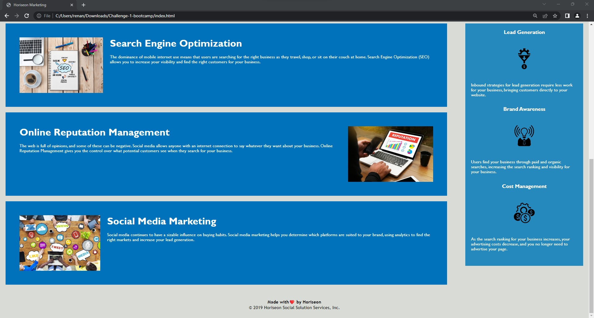

# Horiseon Challenge
## Project Description
This project is related a Marketing agency that wants to improve their website making it more concise and accessible.

## Contents
1. [Deployed-page] (#deployed-page)
2. [Refactor-Comments] (#refactor-comments)
3. [Contributions] (#Contributions)

## Deployed Page

 ,

[Deployed-GitPage] 

## Refactor Comments
* Added comments to Html and Css files.
* Added accessibility elements
* Changed title
* Fixed wrong headers
* Added screenshots 

## Contributions
* Horiseon web page created by UCF Boot Camp.
* Code refactoring completed by Renan Massini.
* Challenge done with my peer Felipe Ursini.